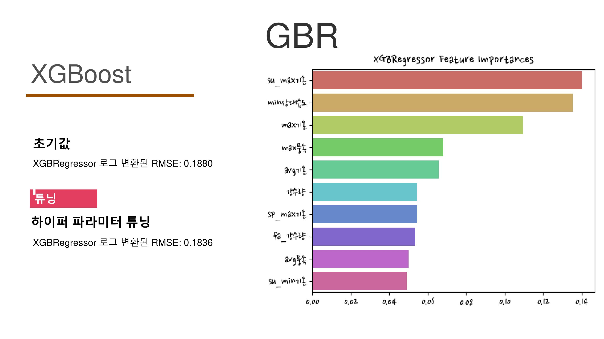

# 사과, 그 달콤함에 대하여
## 프로젝트 소개
지구 온난화와 기후변화로 인해 지역의 평균 기온과 강수량이 변화하고 있습니다. 실제 여러 기사들을 통해 지역의 기후변화가 농작물 생산에 어떻게 영향을 미치고 있는지 알 수 있습니다. 공개된 기후 데이터를 바탕으로 머신러닝을 통해 사과 수확량을 학습하여 어떤 요소가 영향을 미쳐왔는지 알아보고 앞으로 어느 지역이 사과 재배에 효율적인지 예측해보고자 프로젝트를 진행하게 되었습니다.

### 프로젝트 기간
2022.11.28 ~ 2022.12.08

### 참여 인원
* [@곽지섭](https://github.com/ksm463): 데이터 전처리, 머신러닝, 코드관리
* [@김성민](https://github.com/ksm463): 데이터 전처리, 머신러닝, 발표
* [@김태성](https://github.com/chamgirm): 데이터 전처리, ppt, 시각화
* [@이충훈](https://github.com/mysterious-Alchemist): 데이터 전처리, ppt, 시각화
* [@진솔](https://m.blog.naver.com/sj-company1986): 데이터 전처리, ppt

### 사용 기술

    
    
    
    
    

### 개발 환경 및 라이브러리
Windows10 , python3.10, jupyter notebook, pandas, matplotlib, seaborn, sklearn, folium, plotly, bar_chart_race, Ridge, Lasso, ElasticNet, XGBoost, LGBMRegressor

## 구상

경북 남부지역인 대구, 칠곡, 경산, 군위, 청도, 경주, 영천의 사과재배면적은 1990년 7,958헥타르에서 2015년 1,787 헥타르로 반의 반 가까이 줄어든 반면, 경북 북부지역인 안동, 영주, 청송, 문경, 봉화의 재배면적은 같은 기간 5,863헥타르에서 10,292헥타르로 두 배 가까이 늘었습니다. 겨울철 너무 추워 사과 재배에 부적합하다고 여겨졌던 강원도 지역인 영월, 정선, 양구는 같은 기간에 51헥타르에서 343헥타르로 6배 넘게 늘었습니다. 단 25년 만에 사과재배 주산지가 경북남부에서 경북 북부 산간지대로 옮겨졌습니다. 이제 강원도 지역으로까지 확장되고 있습니다.

# 구현
## 데이터 수집 및 전처리

데이터를 어떻게 검색하고 어떤 데이터들을 어디서 수집하는 것이 가장 효율적이고 프로젝트에 적합한지에 대해 토론하고 검토하였습니다.

공공기관 농사로에서 사과 재배 정보를 참고하여 수집 대상을 결정했습니다. 개화기인 3,4월을 봄으로 성장기인 5,6,7월을 여름 수확기인 8,9월을 가을로 설정했습니다. 재배환경을 참고하여 기온과 일조시간, 강수량, 풍속을 수집하기로 했습니다.

수확량은 KOSIS에서 가져왔습니다. 날씨 데이터는 기상청 기상자료개방포털 자료를 기본으로 하고, 누락 자료가 있어서 KOSIS에서 지역데이터를 추가로 수집했습니다.

머신러닝에서 가장 중요하고 어려운것은 이상값 처리가 아닐까하고 생각했습니다. 저희의 경우 온도의 이상값과 강수량의 null값 등 데이터의 이상값으로 여러가지 고민을 했고, 주변지역의 값과 앞뒤시간대의 평균값 등을 이용하여 해결하는 방법을 도출했고 이상값을 처리할 수 있었습니다.

## 시각화

경북지역의 사과생산량이 압도적으로 많습니다. 하지만 눈여겨봐야할 것은 경북에서 거의 독점생산되는 것처럼 보이던 생산량 그래프가 변화하고 있는 것을 보실 수 있습니다.

경북은 거의 재배면적의 차이가 차이가 없는 반면 충청도의 재배면적이 굉장히 상승한 것을 볼 수 있습니다. 또한, 강원도도 주의 깊게 바라볼 필요가 있습니다. 강원도는 사과를 거의 재배하지 않던 곳입니다. 하지만, 21년 기준 꽤 많은 곳에서 사과를 재배하기 시작한 것을 보실 수 있습니다.

단위 면적당 사과 생산량에 대한 그래프입니다. 경북은 비교적 평이한 그래프를 나타내는 한편 충북은 꾸준히 상승하는 그래프를 그리고 있습니다. 가장 중요한 것은 강원입니다. 강원도는 거의 폭등수준의 생산량 그래프를 그리고 있습니다. 저희는 앞서 보여드린 세가지 시각화자료를 머신러닝을 통해 분석하고 미래를 예측해보고자 합니다.

## 머신러닝

먼저 원본 데이터를 확인하였는데 왜곡 정도가 심하지는 않았지만, 모델 성능을 최대한 향상시키기 위해 로그값을 취해서 형태를 정규성이 높도록 만들었습니다. 그래서 예측값을 가져올 때는 다시 로그값을 풀어주어야 합니다.

저희가 사용한 머신러닝의 세가지 모델입니다.
<table>
    <tr>
        <td style="border:none">
            
        </td>
        <td style="border:none">
            
        </td>
        <td style="border:none">
            
        </td>
    </tr>
    <tr>
        <td style="border:none">
            
        </td>
        <td style="border:none">
            
        </td>
    </tr>
</table>

선형회귀에서는 라소와 엘라스틱보다는 릿지의 결과값이 좋아서 릿지 메인으로 보기로 했습니다. 평균기온, 여름 최고 기온 비례하고 최저기온, 봄 최고기온 반비례 했습니다.

xgb는 HyperOpt를 적용하니 파라미터 값이 많이 향상되었습니다.

랜덤 포레스트의 값이 제일 좋아서 이 모델로 예측하기로 했습니다.

## 모델 활용 및 예측 분석

기후변화는 기상청 기후변화 전망보고서를 참조하기로 하였습니다. 강원도 등의 지자체별로 향후 2100년까지의 기상변화값 전망을 다루고 있는데 여기에서 기상변화값을 가져와서, 모델로 예측해보기로 했습니다.

기후변화 모델도 4가지가 있는데 이 중에서 RCP6.0이 가능성이 높은 시나리오로 보고 선택했습니다. 2010년부터 2100년까지의 온도과 강수량 변화 데이터를 추출했습니다. 적용해보니 강원도에서 사과 생산량이 늘어나는 것을 확인할 수 있었습니다.

# 결론 및 한계점
* 기온이 올라가면서 강원도도의 사과 생산량이 올라갈거란 예상이 실제로 맞다는 것을 확인할 수 있었습니다.
* 기후 이외의 요소를 고려하지 않았습니다. 대표적으로 토양도 영향력이 있을텐데 이를 제외한 모델이라 예측에 한계가 있었습니다. 또한 사과 품종 개량의 변수도 있습니다. 사과가 갈수록 더위에 적응하며 강해지고 있습니다. 병충해의 경우는 Kaggle에 유사 모델을 확인해보니 농약 사용량을 변수로 넣었는데 우리나라는 관련데이터가 없어서 포함시키지 못했습니다. 이러한 변수가 추가되면 모델이 더 개선될 여지가 있습니다.